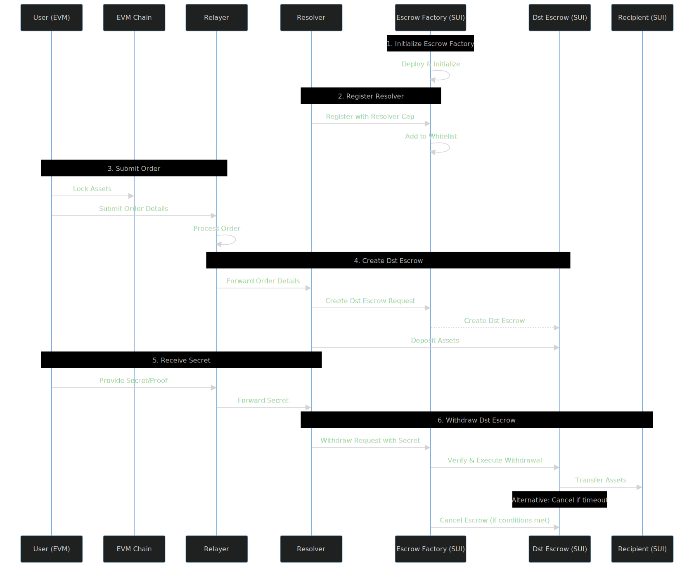
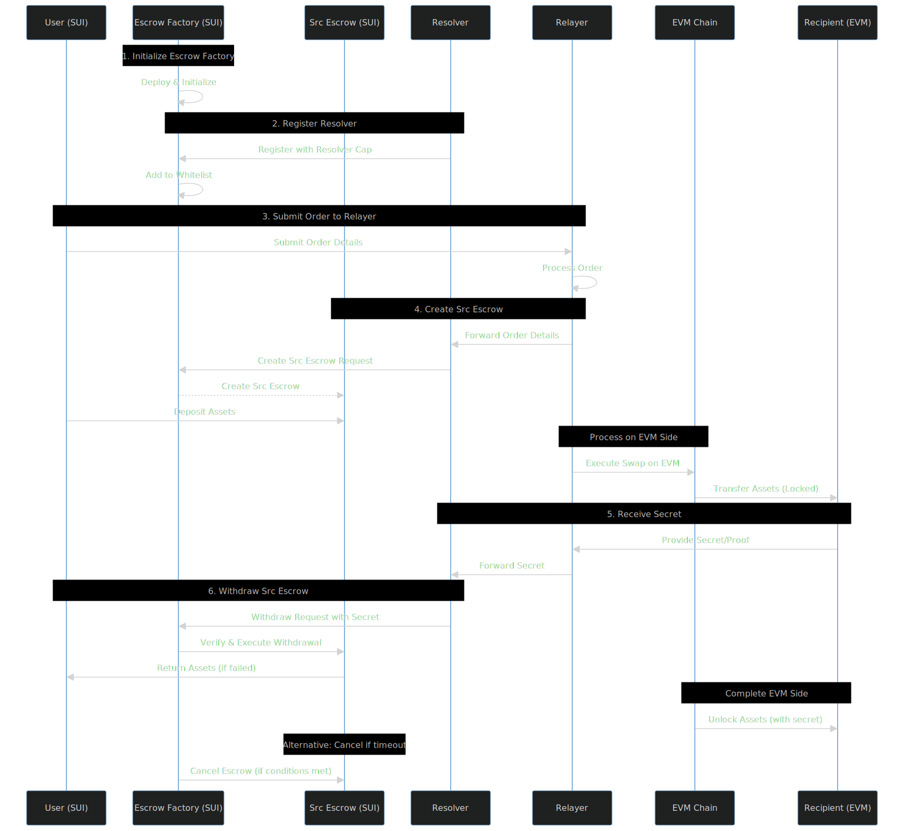

# Sui Fusion Protocol Scripts Guide

## Installation

```bash
pnpm install
```

## Workflow

1. **Publish Move package to Sui:**

    ```bash
    sui publish
    ```

2. **Register resolver whitelist:**

    ```bash
    pnpm tsx ./scripts/register_resolver.ts
    ```

3. **Create destination escrow:**

    ```bash
    pnpm tsx ./scripts/create_dst_escrow.ts
    ```

4. **Create source escrow:**

    ```bash
    pnpm tsx ./scripts/create_src_escrow.ts
    ```

5. **Withdraw destination escrow:**

    ```bash
    pnpm tsx ./scripts/withdraw_dst_escrow.ts
    ```

6. **Withdraw source escrow:**

    ```bash
    pnpm tsx ./scripts/withdraw_src_escrow.ts
    ```

7. **Cancel destination escrow:**

    ```bash
    pnpm tsx ./scripts/cancel_dst_escrow.ts
    ```

8. **Cancel source escrow:**
    ```bash
    pnpm tsx ./scripts/cancel_src_escrow.ts
    ```

## Flow

### Transferring FROM Other Chains TO SUI:

1. Setup → We deploy the escrow factory
2. Security → Whitelist trusted resolvers
3. Receive → Get transfer request from sender's chain
4. Lock → Create escrows on both EVM & SUI and lock
   "from asset" on EVM and "to asset" on SUI
5. Verify → Receive proof of payment
6. Release → Unlock funds to recipient

### Transferring FROM SUI TO Other Chains:

1. Setup → We deploy the escrow factory
2. Security → Whitelist trusted resolvers
3. Request → User submits transfer order
4. Lock → Create escrows on both SUI & EVM and lock
   "from asset" on SUI and "to asset" on EVM
5. Verify → Receive proof of delivery
6. Release → Unlock funds to recipient

## Diagrams

### Cross Chain Swap Overview


### EVM to SUI Flow


### SUI to EVM Flow


## Notes

- Make sure your environment variables are set correctly for Sui and wallet configuration.
- Each script may require specific arguments or configuration; refer to the script source for details.
- Use the provided Makefile for easier script management:
    ```bash
    make list
    make run SCRIPT=create_dst_escrow.ts
    ```
